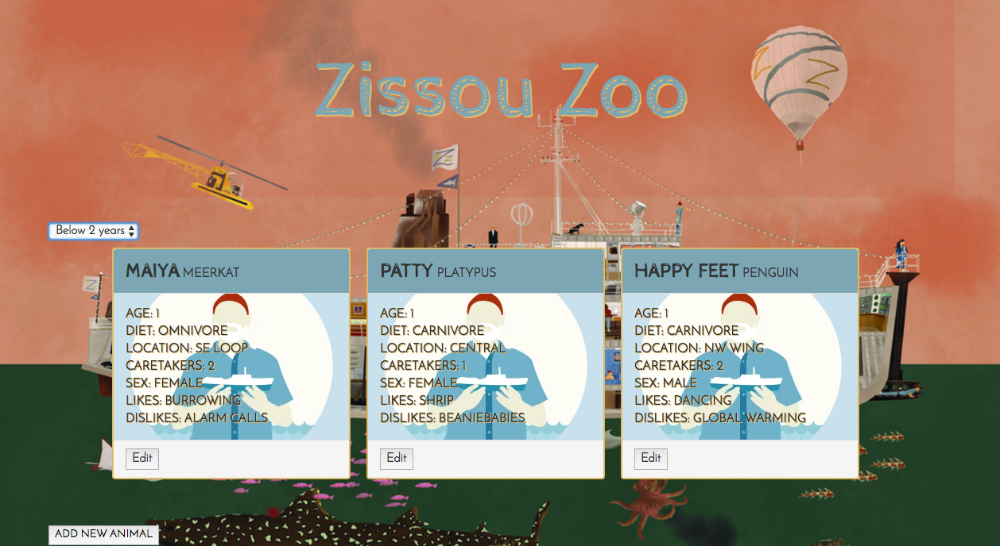

# Zissou Zoo Animal Tracker
#### _Epicodus Angular Javascript: Week 3 Independent Project, August 18, 2017_
_**By Michelle Poterek**_

## Description
This project is for Zissou Zoo employees to view all animals, filter animals to see if they are younger or older than 2, add new animals, and edit them. This project's focus is utilizing two-way data binding, displaying dynamic data, nesting components, and filtering data with a pipe.

## Installation
You can visit the application through this link:
https://zissou-zoo.firebaseapp.com/

OR:
In Terminal,
* `git clone https://github.com/PoterekM/zissou-zoo`
* `cd zissou-zoo`
* `npm install`
* `bower install`
* `ng serve`
* In your browser,
  * Visit the app at http://localhost:4200.

## User Story
* I want to log a newly-admitted animal by submitting a form with animal species, name, age, diet, zoo location, number of needed caretakers, sex, one like and one dislike.
* I want to view a list of animals I have logged.
* I want options to view all animals, only young animals (less than 2 years of age), or only mature animals (2 years of age and older).
* I want to click an animal to edit its name, age or caretakers.

### Wishlist
* Extend the functionality of the app by building out the animal model to further enhance the app.
* Add custom SASS styling with corresponding Gulp tasks to compile.
* Display of the total number of caretakers needed in a day.
* Add a property that records when each animal was admitted. The user could enter a date and time, or the app can generate a timestamp.
* Expand the application to differentiate between animals' species. Group the animals into those categories. Then include a component to display the total needed caretakers for whichever species the user selects.
* Add a new master component to average the total age for each species.
* Show animals based on diet type. Then, show all animals who eat meat (carnivores AND omnivores)

## Development Planning
* Build program using Angular CLI
* Due to lack of using a database, hard code the constructor with Species, Name, Age, Diet, Location, Caretakers, Sex, Likes, and Dislikes so program functionality can easily be seen.
  * Wishlist for styling: add pictures of the zoo
* Create components for animal list, edit animal, new animal.
* Add a pipe for sorting animals less than 2 years old or greater than 2 years old.
* Style application and clean up code.
* Move on to Wishlist items.

## Program Preview

## Technologies Used
* Angular 2
* Bootstrap
* TypeScript
* Google Fonts

## Known Bugs
* The flex box does not adhere to min-height restriction for panels.

## Support and contact details
Please feel free to contact me directly via e-mail at poterekm@gmail.com if you have any questions, comments, ideas, or feedback. Also, I invite you to feel empowered to make any changes to this repository by forking it and making changes accordingly.

## Acknowledgements
* [Background image](https://www.teepublic.com/t-shirt/31512-steve-zissou) for animal tiles

* [Background image for application](http://www.soitgoesmag.com/diary/archive-wes-anderson-in-issue-3)

## License Information
This web application is free to use under the MIT License &copy; Michelle Poterek
